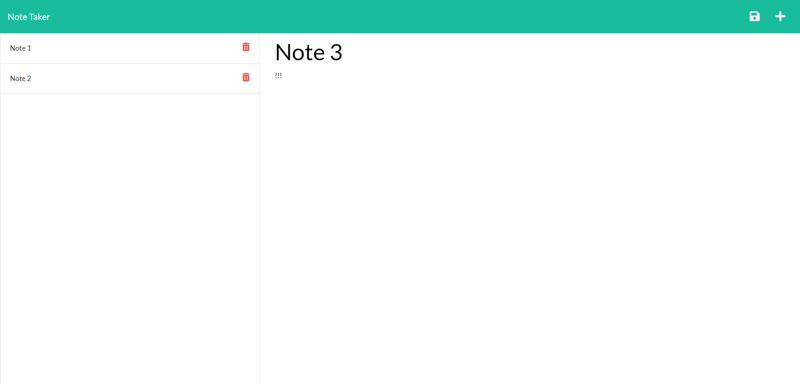

  # Note Taker 

  ## Description
  Need a simple and attractive way to keep notes? This project allows you to quickly add a new note with a title and text to keep track of your tasks. It also allows deleting a note when it's no longer needed.
  

  ## Table of Contents
  [Description](#description)    
  [Installation](#installation)  
  [Usage](#usage)  
  [License](#license)  
  [Contributing](#contributing)  
  [Tests](#tests)  
  [Questions](#questions)

  ## Installation
  Download the source code and deploy it to the local server or a third party server system. Install express and uniqid packages.

  ## Usage
  Use this project to create and delete notes.  
  Heroku Deployment: <https://note-takert0rgy.herokuapp.com/>

  ## License 
  There are no licenses associated with this project.

  ## Contributing
  UW Coding Bootcamp

  ## Tests
  NA

  ## Questions
  Please direct any comments or inquiries using the resources below:  
  GitHub: [T0rgy](https://github.com/t0rgy)  
  Email: <JCTORGE@gmail.com>